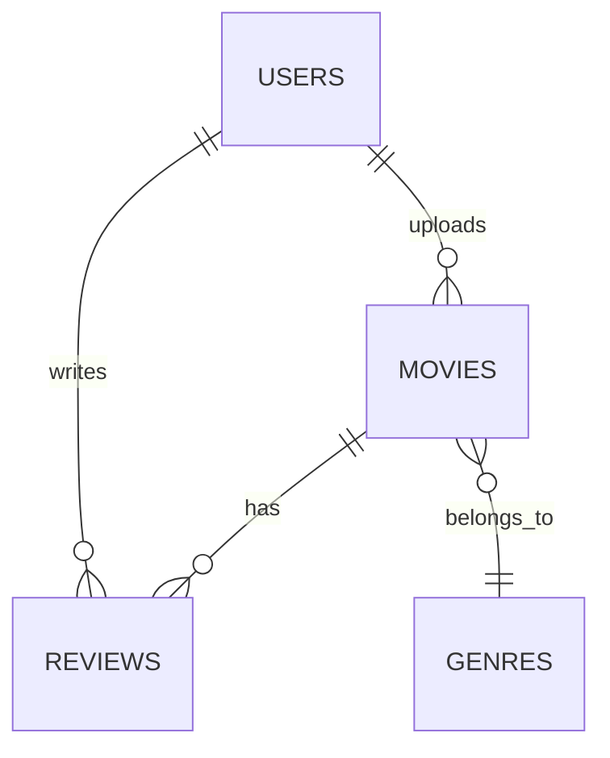

# توثيق مشروع منصة إدارة الأفلام | Movie Platform Management System Documentation

---

## مقدمة | Introduction

نظام ويب متكامل لإدارة منصة أفلام، يتيح للمستخدمين استعراض الأفلام، تقييمها، وكتابة مراجعات، مع لوحة تحكم للإدارة ومديري المحتوى.
A full-featured web system for managing a movie platform, allowing users to browse, review, and rate movies, with admin and content manager dashboards.

---

## بنية النظام | System Architecture

- **واجهة المستخدم (User Interface):**
  - صفحات استعراض الأفلام، التسجيل، تسجيل الدخول، لوحة المستخدم.
- **لوحة تحكم المدير (Admin Dashboard):**
  - إدارة المستخدمين، التقارير، الصلاحيات.
- **لوحة تحكم مدير المحتوى (Content Manager Dashboard):**
  - إدارة الأفلام، الأنواع، العروض، مراجعة التقييمات.
- **واجهة برمجية (API):**
  - نقاط نهاية RESTful للتكامل مع أي تطبيق خارجي.

---

## رسم تخطيطي للعلاقات | Entity Relationship Diagram (ERD)

---

## قاعدة البيانات | Database Structure

- **users:**
  - id, name, email, password, role
- **movies:**
  - id, title, genre_id, year, duration, language, poster_url, description, trailer_url, age_rating, views, movie_url
- **reviews:**
  - id, user_id, movie_id, rating, comment, approved
- **genres:**
  - id, name

---

## الأدوار والصلاحيات | Roles & Permissions

- **مدير (Admin):** إدارة كل شيء، المستخدمين، التقارير.
- **مدير محتوى (Content Manager):** إدارة الأفلام، الأنواع، مراجعة التقييمات.
- **مستخدم (User):** استعراض الأفلام، كتابة مراجعات وتقييمات.

---

## الواجهات الرئيسية | Main Interfaces

- صفحة تسجيل الدخول/التسجيل
- صفحة استعراض الأفلام
- صفحة تفاصيل الفيلم
- صفحة كتابة مراجعة
- لوحة تحكم المدير
- لوحة تحكم مدير المحتوى

---

## أمثلة صور (اختياري) | Example Screenshots (Optional)

---

> لمزيد من التفاصيل حول نقاط النهاية، راجع ملف توثيق الـ API أو README.